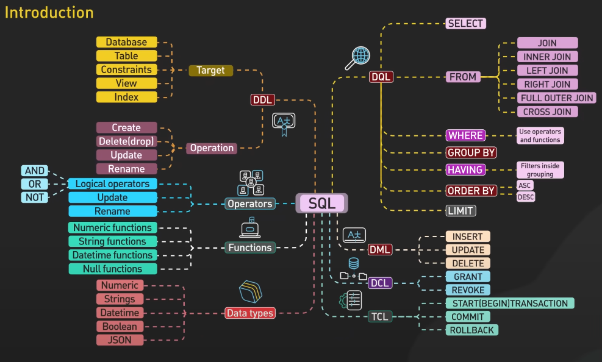
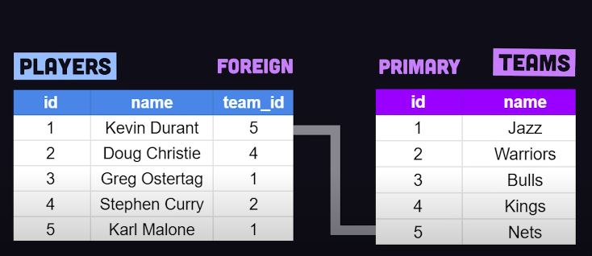
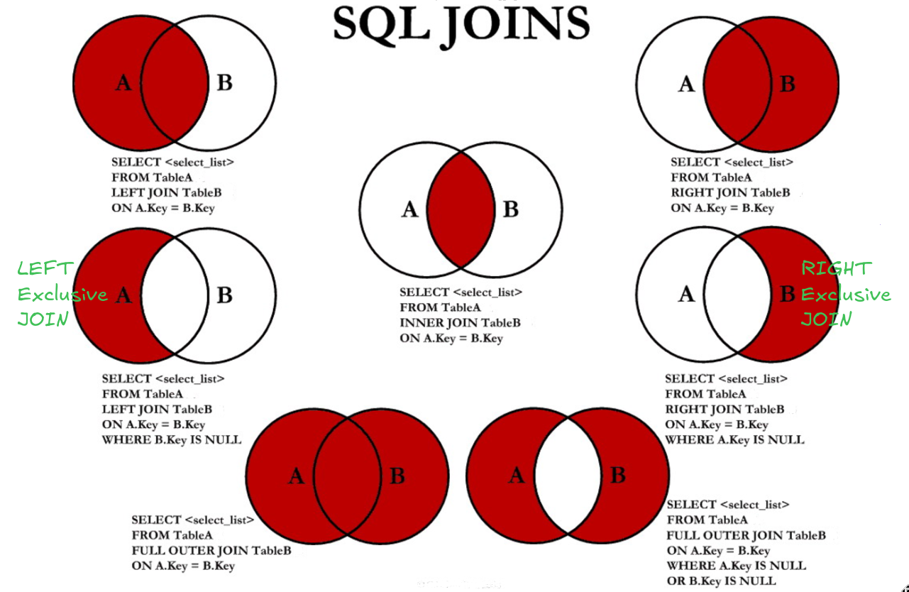

Mindset - learn SQL in context (not syntax) 
- solve real-world problems

Data Types
- TINYINT(-128 to 127)

-Signed & Unsigned

 # commands

# TRUNCATE - deletes data, not the table, can't be rolled back, faster
# DELETE   - removes data, keeps the table, can be rolled back, slower
# CALL - execute stored procedures
# LOCK - prevents others from accessing data during critical operations
# COMMIT - finalizes changes and makes them permanent (git push)
# SAVEPOINT - creates a temporary checkpoint (git stash) to go back to that point
# ROLLBACK  - undo changes (git reset)
SET Transaction ?
- characteristics of a transaction

Hierarchy
- Database-related Queries (DDL)
- Table-related Queries (DML and DDL)
- Data-related Queries (DML and DQL)

Keys # uniquely identify rows and link tables
- Primary - unique, NOT NUll
- A Foreign key refers to another table's primary key, can have duplicates and NUlls, and a table can have multiple foreign keys
- A table can have multiple Candidate keys, and one becomes the primary key
 # player belongs to one team, while a team can have many players
# SELECT lname, team_id, ppg FROM Players
# WHERE ppg > 20
# LEFT JOIN Teams ON Players.team_id = Teams.id;

Constraints # Rules that specify what type of data can be stored
- UNIQUE, NOT NULL
- DEFAULT, CHECK
- Declare a FOREIGN KEY when the required data already exists in another table
# CREATE TABLE customers ( # Parent
#     id INT PRIMARY KEY,
#     name VARCHAR(100));
# CREATE TABLE orders ( # Child
#     cust_id INT,
#     FOREIGN KEY (cust_id) REFERENCES customers(id));
#     ON DELETE CASCADE # Deleting a customer deletes their orders
#     ON UPDATE CASCADE # Updating a customer's ID updates orders

Clause # defines some condition or action
- SELECT * FROM student WHERE marks >= 80 OR city = "Surat";
- Bitwise NOT ~ = UNO Reverse | Bitwise XOR ^ # compares two bits: 1 if different, 0 if the same

Aggregate functions # perform calculations on a set of values (multiple rows of data) and return a single value
- SELECT AVG(marks) FROM student;

SELECT city, COUNT(name) FROM student GROUP BY city; # count number of students in each city
SELECT color, SUM(Quantity) # used w/ Aggregate functions
FROM candies
GROUP BY color # executes before SELECT, sort candies by color, then count each group
ORDER BY count(name) desc;

# WHERE - filters rows before grouping
HAVING  - filters groups of data after GROUP BY
SELECT category, SUM(sales) AS total_sales # find categories where the total sales exceed $10,000
FROM sales
GROUP BY category
HAVING SUM(sales) > 10000;

Order of Execution
- SELECT   # column(s) = print kinda
- FROM     # table_name
- WHERE    # condition
- GROUP BY # column(s)
- HAVING   # condition
- ORDER BY # column(s)
- LIMIT    # - DISTINCT

Table-related Queries (DDL and DML) # set sql_safe_updates = 0;
- UPDATE student SET marks = 12 WHERE rollno = 102;
- DELETE FROM student WHERE marks < 33; ⚠️

ALTER # modifies columns of table
- ALTER TABLE student ADD COLUMN age varchar(10);
- ALTER TABLE student DROP COLUMN age;
- MODIFY # column's data type and properties # not name
- CHANGE # column's name and/or data type # int to varchar

 # combines rows from related tables
INNER # matches common rows only
LEFT  # displays all rows FROM LEFT and matches FROM RIGHT
# - SELECT * FROM student AS a # LEFT
# - INNER JOIN course AS b # RIGHT
# - ON a.id = b.id;
FULL OUTER JOIN - combines all rows, returns matching rows, and fills non-matching rows with NULL # not supported in MySQL
- UNION # combines queries and returns unique values
LEFT Exclusive JOIN # all LEFT data except what overlaps with RIGHT
# - SELECT * # Gets students not enrolled in any course
# - FROM student AS a
# - LEFT JOIN course AS b
# - ON a.id = b.id
# - WHERE b.id IS NULL - keeps only rows exclusive to Table A # jo NULL h Table B m
SELF JOIN - compare rows within the same table, especially for hierarchical or related data
# CROSS JOIN ?

Subquery - query within another query, returns data for the main query # dynamic updates
- SELECT name, salary # find employees with above-average salaries
- FROM employees
- WHERE salary > (SELECT AVG(salary) FROM employees); # 1st step
# - SELECT id, name FROM employees
# - WHERE id IN (SELECT id FROM employees WHERE id % 2 = 0); # Where id is in this list

Views - virtual table

# Terms
Northwind database
Dot-notation

# Vocab
Field: column
Record: row
Aggregate: gather or combine into one
Clause: group of words with both a subject and a predicate
Predicate: part of a sentence that tells what the subject does or what happens to the subject

https://www.reddit.com/r/SQL/comments/1hctp2e/made_a_sql_interview_cheat_sheet_what_key_sql/#lightbox
